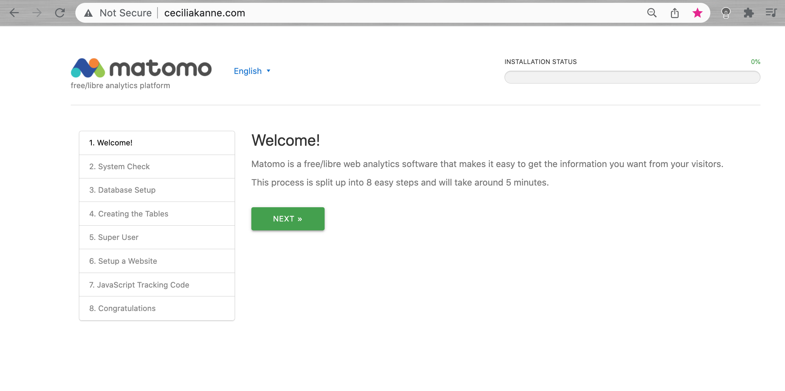

# Matomo Web Analytics

Hello and welcome to the _Matomo Web Analytics_ project!

## Overview
In this exciting project, we will utilize Docker. Specifically, we will install Matomo and a MariaDB database on a Linux server using Docker Compose. For context, [Matomo](https://matomo.org/) is a powerful web analytics app. Additionally, [MariaDB](https://mariadb.org/) is an open-source relational database, and derivative of MySQL. MariaDB is designed to be fast, scalable and robust. Docker Compose is a tool for defining and running multi-container Docker applications.

Next, we will install [Nginx](https://nginx.org/en/), which will serve as our reverse proxy by intercepting requests from clients for the Matomo app. Lastly, we will enable secure HTTPS connections. This will be achieved by using a Certbot ACME (Automated Certificate Management Environment) client, which will download and configure SSL certificates using _[Let's Encrypt](https://letsencrypt.org/)_ (Certificate Authority).

------------------------------------------------
## PART 1: Ubuntu & UFW Firewall Setup

We will begin the project by creating an Ubuntu 20.04 server on AWS. Once this has been created, we will enable and configure a UFW firewall. For context, a UFW firewall is a user-friendly interface that is implemented on top of iptables. It is best practice to increase the security and usability of our server, thus reaching optimal performance. 


1. **_Create an Ubuntu Server on AWS_**

To create an Ubuntu server on AWS, begin by signing in to the [AWS Management Console](https://aws.amazon.com/console/). After you have signed in, select your preferred region (this should be the closest region to your physical location). 

Next, navigate to EC2 service and select `Launch Instances`. Select `Ubuntu Server 20.04 LTS (HVM)` as the Amazon Machine Image (AMI). After that, configure the instance by selecting `t2.micro` as the instance type. Next, configure the security groups by allowing all traffic from anywhere (0.0.0.0/0, ::/0). These rules will open your server to the world, and allow all IP addresses to access it. Once you have made these selections, select `Review and Launch`. Be sure to create or use an existing RSA key pair, then click `Download`. Finally, launch the instance. 

Here's an example of the running instance:


2. **_SSH into Ubuntu Server_**

Now it's time to connect to your Ubuntu instance from your local PC! 

_**PLEASE NOTE**: Anchor Tags **< >** will be used to indicate contents what must be replaced with your unique values. For example, if you have a file named **"keypair123.pem"** you must enter this information within the corresponding anchor tag: **< private-key-name >**_


Begin by opening Terminal on your local PC. Once you have opened Terminal, use the `cd` command to change into the directory that your key pair is located. This is usually the `~/Downloads` directory. If you are having difficulty finding it, you can use the `ls` command to list the contents of your current directory, or `pwd` to display the current pathway of directories. 

Once you have located the key file (.pem) file, use the command below to activate it. This command will change the permissions (otherwise you may get the error `Bad Permissions`):

```jsx
$ sudo chmod 400 <private-key-name>.pem
```

Next, SSH into your Ubuntu server using the following command:

```jsx
$ ssh -i <private-key-name>.pem ubuntu@<Public-IP-address>
```


_**PLEASE NOTE**_: _the public IP address of your Ubuntu server can be located within the "Instances (Running)" section of the `EC2 Dashboard` on the AWS Console._

Once you have connected to your Ubuntu server, run the following command to switch to the `root` user:

```
$ sudo su
```
Now that you are the root user, you will be able to add the _new_ user account, which will be designated for regular usage. Once we have created this new user, we will log in with this new account instead of the **root** user.

For this example, the new user will be called **cecilia** (_this is my name!_), but you may replace this with any username that you desire:

```jsx
# adduser <cecilia>
```

You will be asked a few questions, starting with the account password. Be sure to enter a strong password and keep it someplace safe.

For the remaining values, you have the option to fill in the information. If you do not want to fill in your information, you may skip each value by pressing `ENTER`.


3. **_Granting Administrative Privileges_**

Great job! Now we have a brand new user account with regular account privileges. However, sometimes we may need to perform administrative tasks, which require higher privileges. We can assign _superuser_ or **`root`** privileges by placing **`sudo`** before our commands.

In order to add these privileges to our new user, we need to add the user to the `sudo` group. The Ubuntu 20.04 server enables users to use the `sudo` command by default, if they are members of the `sudo` group!

Let's continue by adding the newly created user to the `sudo` group (remember to substitute the highlighted username with your new user):

```jsx
# usermod -aG sudo <cecilia>
```

Now, when you are logged in as your regular user, you can type `sudo` before commands to run them with superuser privileges.


3. **_Setting Up a Basic Firewall_**

The UFW firewall will be used to ensure that only connections to certain services are permitted. 

FThe **OpenSSH** is the service that will allows us to connect to our server, and it has a profile registered with UFW!

Use the following command to observe this:

```
# ufw app list
```

In order to ensure that the firewall allows SSH connections so that we can log back in later, use the following command:

```
# ufw allow OpenSSH
```

Next, enable the firewall using the following command:

```
# ufw enable
```

After using this command, you will be prompted whether or not you wish to proceed. Type `Y`and then type `ENTER` to proceed. 

In order to examine the status of SSH connections, use the following command:

```
# ufw status
```


------------------------------------------------
## PART 2: Enabling External Access for Regular User

Great job! We have now established a regular user, which may be used to daily tasks. Next, we must ensure that we can directly SSH into the regular user account. 

In order to achieve this configuration, we must determine whether your Ubuntu server’s **root** account uses a _password_ or _SSH keys_ for authentication.

_Authentication via Password_

If you logged in to your **`root`** account using a _password_, then this means that password authentication is enabled for SSH. Therefore, we can SSH into the new user account using the following command:

```jsx
$ ssh <cecilia>@<your_server_ip>
```
When prompted, enter your regular user’s password and then press `Enter`. Remember, whenever necessary, use administrative privileges by typing `sudo` before commands. You will be prompted for your regular user _password_ when using `sudo` for the first time or periodically throughout each session.

_Example_:
```jsx
$ sudo <command_to_run>
```


**TROUBLESHOOTING**:

It is possible to receive an error message that says: _**Permission Denied (publickey)**_. If you do _not_ have this error, please skip ahead to the next section below. Otherwise, if you do have this error, then we can resolve it by modifying the configuration file. Use the following command in your Ubuntu server: 

```
$ sudo nano /etc/ssh/sshd_config
```

Next, scroll through the file and make the following changes:

**Change `# PermitRootLogin prohibit-password` to the following:**

```
# PermitRootLogin yes
```

**Next, change `# PasswordAuthentication no` to the following:**

```
# PasswordAuthentication yes
```


Once you have made these changes, save  the file using `ctrl + O`, and then exit Nano using `ctrl + X`. 

Next, restart the server by running the following command:

```
$ sudo service ssh restart
```
Now  you should be able to SSH with your new username. Try this command again:

```jsx
$ ssh cecilia@<your_server_ip>
```


----------------------------------------------------------------------------------------

## PART 3: Setting Up SSH Keys

In order to enhance your Ubuntu server’s security, it is strongly recommended to set up SSH keys _instead_ of using password authentication.

What is SSH? SSH, or secure shell, is an encrypted protocol which is used to administer and communicate with other servers. SSH keys provide a secure way to log into your Ubuntu server, which is aligns with best security practices.

1. **_Creating the Key Pair_**

Begin by creating a key pair on the client machine (usually your computer):

```
$ ssh-keygen
```

Next, press enter to save the key pair into the `.ssh` subdirectory in your home directory. You may specify an alternate path if you prefer to do so.


Next, you will be prompted to enter a passphrase. It is best practice to enter a secure passphrase, in order to prevent unauthorized users from logging in.

Once you have entered your passphrase, you should then see the output similar to the following:


You now have a public and private key that you can use to authenticate. The next step is to place the public key on your server!

2. **_Copying the Public Key to Your Ubuntu Server_**

The quickest and easiest way to copy your public key to the Ubuntu host is to use a utility called `ssh-copy-id`. This useful tool is included by default in many operating systems. However, in order for this method to work, you must already have password-based SSH access to your server.

To use the utility, specify the username and remote host that you would like to connect to, as outlined in the following command: 

The syntax is:

```jsx
$ ssh-copy-id <username>@<remote_host>
```

You will see an "authenticity of host" message, which means that your local computer does not recognize the remote host. This will happen the first time you connect to a new host. Type “yes” and press `ENTER` to continue.

Next, the utility will scan your local account for the `id_rsa.pub` key that we created earlier. Once it locates the key, it will prompt you for the password of the remote user’s account.

Type in the password and press `ENTER`. You should see something like this:


Great job! Now, your `id_rsa.pub` key has been successfully uploaded to the remote account!


------------------------------------------------
## PART 4: Installing Docker

[Docker](https://www.docker.com/) is an application that simplifies the process of managing application processes in _containers_. Containers allow users to run applications in resource-isolated processes. In this section, we will install Docker then use it to work with containers and images, and then push an image to a Docker Repository.

### _Prerequisites_

Before your proceed, you will need the following:

- One Ubuntu 20.04 server set up  including a sudo non-root user and a firewall.
- An account on [Docker Hub](https://hub.docker.com/) if you wish to create your own images and push them to Docker Hub

1. **_Docker Installation Procedure_**

To ensure we get the latest version, we’ll install Docker from the official Docker repository. To do that, we’ll add a new package source, add the GPG key from Docker to ensure the downloads are valid, and then install the package.

First, while logged into your regular user account, update your existing list of packages using the following command:

```
$ sudo apt update
```

When prompted, type in your regular user's password, then press `Enter`. Next, install a few prerequisite packages which let `apt` use packages over HTTPS using the following command:

```
$ sudo apt install apt-transport-https ca-certificates curl software-properties-common
```

After using this command, you will be prompted whether or not you wish to proceed. Type `Y`and then type `ENTER` to proceed with the instillation.

Next, add the GPG key for the official Docker repository to your system using the following command:

```
$ curl -fsSL https://download.docker.com/linux/ubuntu/gpg | sudo apt-key add -
```
You should see an output that says: `OK`

Next, add the Docker repository to `APT` sources using the following command:

```
$ sudo add-apt-repository "deb [arch=amd64] https://download.docker.com/linux/ubuntu $(lsb_release -cs) stable"
```

This will also update our package database with the Docker packages from the newly added repository.

Next, ensure that you are installing from the Docker repo, rather than the default Ubuntu repo, by running the following command:

```
$ apt-cache policy docker-ce
```

Finally, install Docker:

```
$ sudo apt install docker-ce
```
When prompted, press `Y` to continue instillation.

The instillation may take a few minutes. Please be patient! Once the instillation is complete, check to see that it’s running using the following command:

```
$ sudo systemctl status docker
```

The output should be similar to the following, which shows that the service is active and running:


Installing Docker adds the capability of using the Docker service (daemon) and the `docker` command line utility (Docker client)! We will delve deeper into this shortly.

2. **_Executing the Docker Command without `Sudo` (Optional)_**

By default, the `docker` command can only be run the **root** user or by a user in the **docker** group, which is automatically created during Docker’s installation process. 

Add your username to the `docker` group using the following command:

```
$ sudo usermod -aG docker ${USER}
```

To apply the new group membership, log out of the server and back in, or type the following:

```
$ su - ${USER}
```

You will be prompted to enter your user’s password to continue. Confirm that your user is now added to the **Docker** group by typing the following:

```
$ groups
```

If you need to add a user to the `docker` group that you’re not logged in as,use the following command:

```
$ sudo usermod -aG docker <username>
```


3. **_Using the Docker Command_**

The `docker` command syntax takes this form:

_Example:_
```jsx
$ docker <option> <command> <arguments>
```

To view all available subcommands, type:

```
$ docker
```

As of **Docker 19**, the complete list of available subcommands include the following:

```
Output:

  attach      Attach local standard input, output, and error streams to a running container
  build       Build an image from a Dockerfile
  commit      Create a new image from a container's changes
  cp          Copy files/folders between a container and the local filesystem
  create      Create a new container
  diff        Inspect changes to files or directories on a container's filesystem
  events      Get real time events from the server
  exec        Run a command in a running container
  export      Export a container's filesystem as a tar archive
  history     Show the history of an image
  images      List images
  import      Import the contents from a tarball to create a filesystem image
  info        Display system-wide information
  inspect     Return low-level information on Docker objects
  kill        Kill one or more running containers
  load        Load an image from a tar archive or STDIN
  login       Log in to a Docker registry
  logout      Log out from a Docker registry
  logs        Fetch the logs of a container
  pause       Pause all processes within one or more containers
  port        List port mappings or a specific mapping for the container
  ps          List containers
  pull        Pull an image or a repository from a registry
  push        Push an image or a repository to a registry
  rename      Rename a container
  restart     Restart one or more containers
  rm          Remove one or more containers
  rmi         Remove one or more images
  run         Run a command in a new container
  save        Save one or more images to a tar archive (streamed to STDOUT by default)
  search      Search the Docker Hub for images
  start       Start one or more stopped containers
  stats       Display a live stream of container(s) resource usage statistics
  stop        Stop one or more running containers
  tag         Create a tag TARGET_IMAGE that refers to SOURCE_IMAGE
  top         Display the running processes of a container
  unpause     Unpause all processes within one or more containers
  update      Update configuration of one or more containers
  version     Show the Docker version information
  wait        Block until one or more containers stop, then print their exit codes

```

To view the options available to a specific command, type:

```
$ dockerdocker-subcommand --help
```

To view system-wide information about Docker, use:

```
$ docker info
```

Let’s explore some of these commands. We’ll start by working with images.

4. **_Working with Docker Images_**

Docker containers are built from Docker images. What is a Docker image? It is a template that contains instructions for deploying containers. By default, Docker pulls these images from [Docker Hub](https://hub.docker.com/), which is a Docker registry managed by Docker. 

In order to check whether we can access and download images from Docker Hub, run the following command:

```
$ docker run hello-world
```

The output indicates that Docker is working correctly:


How did it do this? Docker was initially unable to find the `hello-world` image locally, therefore it downloaded the image from Docker Hub.

Next, Docker created a container from the image and the application within the container executed, displaying the message shown in the output above!

We can also search for images available on Docker Hub. Let's use the following command to search for the Ubuntu image:

```
$ docker search ubuntu
```

This script will crawl Docker Hub and return a listing of all images whose name match the search string:


Execute the following command to download the official `ubuntu` image to your computer:

```
$ docker pull ubuntu
```

You’ll see the following output:


Now that the image has been downloaded, you can then run a container using the downloaded image with the `run` subcommand.

To see the images that have been downloaded to your computer, type:

```
$ docker images
```

The output will look similar to the following:


As you’ll see later in this tutorial, images that you use to run containers can be modified and used to generate new images! These can then be uploaded (or _pushed_) to Docker Hub.

In the next step, we will examine how to run containers.

5. **_Running a Docker Container_**

The `hello-world` container that was run in the previous step is an example of a container that runs and exits after emitting a test message.

Let’s run a container using the latest image of Ubuntu. The combination of the **-i** and **-t** switches grants interactive shell access into the container:

```
$ docker run -it ubuntu
```

You should notice that the prompt will reflect the fact that you’re now working _inside_ of the container! 

In this case, it  will look like this:

``` 
Output:

root@edd64549ffbe:/# 
```

Now you can run any command inside the container! For example, let’s update the package database inside the container as the **`root`** user:

```
# apt update
```

Then install any application in it. Let’s install Node.js:

```
# apt install nodejs
```
This command installs Node.js in the container from the official Ubuntu repository. 

Please select the geographic area that you live in. Select the city and region that best corresponds to your time zone.


When the installation is complete, verify that Node.js is installed using the following command:

```
# node -v
```

You’ll see the version number displayed in your terminal:

```
Output:

v10.19.0
```

To exit the container, type `exit`.

Nice work! In the next section, we will look at managing the containers on our system.


----------------------------------------------------
## PART 5: Managing Docker Containers

In order to view the active (running) containers on your computer, use the following:

```
$ docker ps
```

Recall that earlier in this tutorial, we started two containers. One was from the `hello-world` image, and the other was from the `ubuntu` image. Both of the containers are no longer running, however they still exist on your system!

To view all containers — **both active and inactive**, use  the following:

```
$ docker ps -a
```

Next, to view the **latest** container you created, use  the following:

```
$ docker ps -l
```
Here is a summary of what you can expect to see as the output:


To **start** a container, use `docker start`, followed by the container ID or the container’s name. 

Let’s start the Ubuntu-based container with the ID of `edd64549ffbe`:

```
$ docker start edd64549ffbe
```

You may use `docker ps` again to see the container's status. You’ll see output similar to this:


To stop a running container, use `docker stop`, followed by the container ID or name. This time, we’ll use the name that Docker assigned the container, which is `jolly_kepler`:

```
$ docker stop jolly_kepler
```

Once you’ve decided you no longer need a container anymore, remove it with the `docker rm` command, again using either the `container ID` or the `name`. Use the `docker ps -a` command to find the container ID or name for the container associated with the `hello-world` image and remove it.

```jsx
$ docker rm pensive_kapitsa
```


You can start a new container and give it a name using the `--name` switch. You can also use the `--rm` switch to create a container that removes itself when it’s stopped. 

For more information on these options and others, run the `docker run help` command.

Containers can be turned into images which you can use to build new containers. Let’s discover how this works together in the upcoming steps.

1. **_Committing Changes in a Container to a Docker Image_**

When starting a Docker image, you can create, modify, and delete files just like you can with a virtual machine! Remember that the changes that you make will _only_ apply to that container.  Furthermore, you can start and stop it, however, once you destroy it with the `docker rm` command, there's no going back!

In this step, we will learn how to save the state of a container as a new Docker image.

In order to commit the changes to a new Docker image instance, use the following command format:

```jsx
$ docker commit -m "What you did to the image" -a "Author Name" container_idrepository/new_image_name
```

- The **-m** switch is for the commit message that helps you and others know what changes you made. 
- The  **-a** switch is used to specify the author. 
- The `container_id` is the one you noted earlier in the tutorial. 
- Lastly, the `repository` is usually your Docker Hub username. 

For example, for the user **cecilia**, with the container ID of `edd64549ffbe`, the command would be:

```
$ docker commit -m "added Node.js" -a "cecilia" edd64549ffbe cecilia/ubuntu-nodejs

```

When you *commit* an image, the new image is saved locally on your computer. Later in this tutorial, we will learn how to push an image to a Docker registry like Docker Hub so others can access it.

We can list all of the Docker images, including the the new image and the old ones that it was derived from, using the following:

```
$ docker images
```

You’ll see output like this:


In this example, `ubuntu-nodejs` is the new image, which was derived from the existing `ubuntu` image from Docker Hub. 

You can also build Images from a `Dockerfile`, which allows you to automate the installation of software in a new image.

Now let’s share the new image with others, so they may also create containers from it!

2. **_Pushing Docker Images to a Docker Repository_**

 This section shows you how to push a Docker image to Docker Hub. To push an image to Docker Hub or any other Docker registry, you must have an account.

To push your image, first log into Docker Hub, use the following command:

```
docker login
```

You will be prompted to authenticate using your Docker Hub password. Once you type in your password, the message will display "login succeeded".


**Note:** If your Docker registry username is different from the local username you used to create the image, you will have to tag your image with your registry username. For the example given in the last step, use the following command:

```jsx
$ docker tag 6a5a58180dd3 ceciliacloud/ubuntu-nodejs
```

To push the `ubuntu-nodejs` image to your Docker repository, the command would be:

```
$ docker push ceciliacloud/ubuntu-nodejs
```

The process may take some time to complete as it uploads the images, but when completed, the output will look like this:


After pushing an image to a registry, it should be listed on your account’s dashboard, as shown in the image below:


--------------------------------------------------------

## PART 6: Docker Compose

[Docker Compose](https://docs.docker.com/compose/) is a tool that allows users to run multi-container application environments based on the definitions set in a YAML file. It then utilizes service definitions to build fully customizable environments with multiple containers that can share networks and data volumes.

In this guide, we will demonstrate how to install Docker Compose on an Ubuntu 20.04 server and then how to use this tool!


Before we begin, ensure that you have installed most updated stable version of Docker Compose, which can be downloaded from the [official Github repository](https://github.com/docker/compose). At the time of this writing, the most current stable version is `1.27.4`.

The following command will download the `1.27.4` release and save the executable file at `/usr/local/bin/docker-compose`, which will make this software globally accessible as `docker-compose`:

```
$ sudo curl -L "https://github.com/docker/compose/releases/download/1.27.4/docker-compose-$(uname -s)-$(uname -m)" -o /usr/local/bin/docker-compose
```
When prompted, type your regular user's password and press `Enter`.

Next, set the correct permissions so that the `docker-compose` command is executable:

```
$ sudo chmod +x /usr/local/bin/docker-compose
```

To verify that the installation was successful, you can run:

```
$ docker-compose --version
```

You’ll see output similar to this:


Docker Compose is now successfully installed on your system. In the next section, we’ll see how to set up a `docker-compose.yml` file and get a containerized environment up and running with this tool.

1. **_Setting up a `docker-compose.yml` File_**

To demonstrate how to set up a `docker-compose.yml` file and work with Docker Compose, we will create a web server environment using the official [Nginx image](https://hub.docker.com/_/nginx) from [Docker Hub](https://hub.docker.com/), which is the public Docker registry. This containerized environment will serve a single static HTML file.

Now that we're all set up, let's begin by creating a new directory in your home folder, and then changing into it's directory:

```
$ mkdir ~/compose-demo

$ cd ~/compose-demo
```

In this directory, set up an application folder to serve as the document root for your Nginx environment:

```
$ mkdir app
```
Using your preferred text editor, create a new `index.html` file within the `app` folder:

```
$ nano app/index.html

```

Place the following content into the `~/compose-demo/app/index.html` file:

```jsx
<!doctype html>
<html lang="en">
<head>
    <meta charset="utf-8">
    <title>Docker Compose Demo</title>
    <link rel="stylesheet" href="https://cdn.jsdelivr.net/gh/kognise/water.css@latest/dist/dark.min.css">
</head>
<body>
  <h1>This is a Docker Compose Demo Page.</h1>
  <p>This content is being served by an Nginx container.</p>
</body>
</html>
```

Save and close the file when you’re done. If you are using `nano`, you can do that by typing `CTRL+X`, then `Y` and `ENTER` to confirm.


Next, create the `docker-compose.yml` file:

```
$ nano docker-compose.yml
```

Insert the following content on your `docker-compose.yml` file, then save and close the file:


```
version: '3.7'
services:
  web:
    image: nginx:alpine
    ports:
      - "8000:80"
    volumes:
      - ./app:/usr/share/nginx/html
```


As demonstrated above, the `docker-compose.yml` file begins with the `version` definition. This tells Docker Compose which configuration version we are using.

We then have the `services` block, which is the location of the services that are part of this environment. In our case, we have a single service called `web`. This service uses the `nginx:alpine` image and then sets up a port redirection with the `ports` directive. All of the requests on port `8000` of the host machine (the system from where you’re running Docker Compose) will be redirected to the `web` container on port `80`, where Nginx will be running.

Lastly, the `volumes` directive will create a [shared volume](https://docs.docker.com/compose/compose-file/#volumes) between the host machine and the container. This will share the local `app` folder with the container, and the volume will be located at `/usr/share/nginx/html` inside the container, which will then overwrite the default document root for Nginx.

Save and close the file.

Now we have set up a demo page and a `docker-compose.yml` file which will be used to create a containerized web server environment that will serve it. 

In the next step, we’ll bring this environment up with Docker Compose.

2. **_Running Docker Compose_**

The following command will download the necessary Docker images, create a container for the `web` service, and run the containerized environment in background mode:

```
$ docker-compose up -d
```

You should see something like this:


To verify that the container is active, run the following:

```
$ docker-compose ps
```

This command will show you information about the running containers and their state, as well as any port redirections that are currently in place.


You can now access the demo application by pointing your browser to either `localhost:8000` if you are running this demo on your local machine, or `your_server_domain_or_IP:8000` if you are running this demo on a remote server.

You’ll see a page like this:


Great job! In the next step, we will discover how to manage your containerized environment with Docker Compose commands.

3. **_Getting Familiar with Docker Compose Commands_**

Now that we have seen how to set up a `docker-compose.yml` file and bring your environment up with `docker-compose up`. Next, we will discover how to use Docker Compose commands to manage and interact with your containerized environment.

To check the logs produced by your Nginx container, you can use the `logs` command:

```
$ docker-compose logs
```

You’ll see output similar to this:


If you want to pause the environment execution without changing the current state of your containers, you can use:

```
$ docker-compose pause
```

To resume execution after issuing a pause:

```
$ docker-compose unpause
```

The `stop` command will terminate the container execution, but it won’t destroy any data associated with your containers:

```
$ docker-compose stop
```

If you want to remove the containers, networks, and volumes associated with this containerized environment, use the `down` command:

```
$ docker-compose down
```


The output will appear similar to this:


In case you want to also remove the base image from your system, you can use:

```
$ docker image rm nginx:alpine
```


Finally, to enable SSL you’ll need a domain name pointed at your server’s public IP address. This should be something like `example.com`.

If you do not already a domain, you can create a new domain using [Google Domains](https://domains.google/):

To set up a domain with your cloud account, you need to add it (and any of its existing DNS records) to the control panel, then delegate the domain by updating your registrar to use your domain name servers.

Here's an example of my Ubuntu server's public IP address added to my personal domain's DNS records using Google Domains.


When you’ve satisfied all the prerequisites, proceed to **Part 7**, where you’ll download and launch the Matomo software.

------------------------------------------------
## PART 7: Running Matomo and MariaDB with Docker Compose

This section will put your configuration inside a `matomo` directory in your home directory.

Let's begin by creating the Docker Compose configuration that will launch containers for both the Matomo app and a MariaDB database.

First ensure you’re in your home directory:

```
$ cd ~
```

Then create the `matomo` directory and `cd` into it:

```
$ mkdir matomo

$ cd matomo
```

Now open a new blank YAML file called `docker-compose.yml`:

```
$ nano docker-compose.yml
```

This is the configuration file that the `docker-compose` software will read when bringing up your containers. Paste the following into the file:

docker-compose.yml

```
version: "3"

services:
  db:
    image: mariadb
    command: --max-allowed-packet=64MB
    restart: always
    environment:
      - MARIADB_DATABASE=matomo
      - MARIADB_USER
      - MARIADB_PASSWORD
      - MARIADB_ROOT_PASSWORD
    volumes:
      - ./db:/var/lib/mysql

  app:
    image: matomo
    restart: always
    volumes:
      - ./matomo:/var/www/html
    ports:
      - 127.0.0.1:8080:80

```


This file defines two `services`, one `db` service which is the MariaDB container, and an `app` service which runs the Matomo software. Both services also reference a named volume where they store some data, and the `app` service also opens up port `8080` on the loopback (`127.0.0.1`) interface, which we will connect to via `localhost`.

Save the file and exit your text editor to continue. In `nano`, press `CTRL+O` then `ENTER` to save, then `CTRL+X` to exit.

The MariaDB container needs some configuration to be passed to it through environment variables in order to function properly. 

It is best practice to keep passwords out of your `docker-compose.yml` file, especially if you’ll be committing it to a Git repository or other source control system.

Instead, we’ll put the necessary information in a `.env` file in the same directory, which the `docker-compose` command will automatically load when we start our containers.

Open a new `.env` file with `nano`:

```
$ nano .env
```

You’ll need to fill in a user name and password, as well as a strong password for the MariaDB **root** superuser account:

.env

```jsx
MARIADB_USER=matomo
MARIADB_PASSWORD=a_strong_password_for_user
MARIADB_ROOT_PASSWORD=a_strong_password_for_root
```

If you need help creating strong passwords you can use the `openssl` command to print out a random 30 character hash, which you can use as a password:

```
$ openssl rand 30 | base64 -w 0 ; echo
```

When you’re done filling out the information in your `.env` file, save it and exit your text editor. 

Next, let's bring up the two containers with `docker-compose` using the following command:

```
$ sudo docker-compose up -d
```

The `up` subcommand tells `docker-compose` to start the containers (and volumes and networks) defined in the `docker-compose.yml` file. The `-d` flag tells it to do so in the background (“daemonize”), as shown here:


When that’s done, Matomo should be running. You can test that a webserver is running at `localhost:8080` by fetching the homepage using the `curl` command:

```
$ curl --head http://localhost:8080
```

This will print out only the HTTP headers from the response:


The `200 OK` response means the Matomo server is up and running, but it’s only available on `localhost`. The highlighted `X-Matomo-Request-Id` header indicates that the server is Matomo and not something else that might be configured to listen on port 8080. Next we’ll set up Nginx to proxy public traffic to the Matomo container.

2. **_Installing and Configuring Nginx_**

The use of the Nginx in front of our Matomo server can improve performance by offloading caching, compression, and static file serving to a more efficient process.

First, refresh your package list, then install Nginx using the following commands:

```
$ sudo apt update

$ sudo apt install nginx
```

Allow public traffic to ports `80` and `443` (HTTP and HTTPS) using the “Nginx Full” UFW application profile:

```
$ sudo ufw allow "Nginx Full"
```

```
Output:

Rule added
Rule added (v6)
```

Next, open up a new Nginx configuration file in the `/etc/nginx/sites-available` directory:

```
$ sudo nano /etc/nginx/sites-available/matomo.conf
```

Paste the following into the new configuration file. Be sure to replace `your_domain_here` with the domain that you’ve configured to point to your Matomo server:

/etc/nginx/sites-available/matomo.conf

```jsx
server {
    listen       80;
    listen       [::]:80;
    server_name  your_domain_here;

    access_log  /var/log/nginx/matomo.access.log;
    error_log   /var/log/nginx/matomo.error.log;

    location / {
      proxy_set_header X-Forwarded-For $proxy_add_x_forwarded_for;
      proxy_set_header X-Real-IP $remote_addr;
      proxy_set_header X-Forwarded-Host $host;
      proxy_set_header X-Forwarded-Proto https;
      proxy_pass http://localhost:8080;
  }
}
```


Save and close the file, then enable the configuration by linking it into `/etc/nginx/sites-enabled/`:

```
$ sudo ln -s /etc/nginx/sites-available/matomo.conf /etc/nginx/sites-enabled/
```

Use `nginx -t` to verify that the configuration file syntax is correct:

```
$ sudo nginx -t
```

And finally, reload the `nginx` service to pick up the new configuration:

```
$ sudo systemctl reload nginx
```


Your Matomo site should now be available on plain HTTP. Load `http://your_domain_here` (you may have to click through a security warning) and it will look like this:




Now that you have your site up and running over HTTP, it’s time to secure the connection with Certbot and Let’s Encrypt certificates. You should do this *before* going through Matomo’s web-based setup procedure.

3. **_Installing Certbot and Setting Up SSL Certificates_**

Thanks to Certbot and the Let’s Encrypt free certificate authority, adding SSL encryption to our Matomo app will take only two commands.

First, install Certbot and its Nginx plugin:

```
$ sudo apt install certbot python3-certbot-nginx

```
When prompted, press `Y` to continue instillation.

Next, run `certbot` in `--nginx` mode, and specify the same domain you used in the Nginx `server_name` config:

```
$ sudo certbot --nginx -dyour_domain_here
```

You will be prompted to agree to the Let’s Encrypt terms of service, and to enter an email address.

Next, you’ll be asked if you want to redirect all HTTP traffic to HTTPS. It is generally recommended and safe to do.

Next, Let’s Encrypt will confirm your request and Certbot will download your certificate:


4. **_Setting Up Matomo_**

Back in your web browser you should now have Matomo’s **Welcome!** page open via a secure `https://` connection. Now you can enter usernames and passwords safely to complete the installation process.

Click the **Next** button. You’ll be taken to the **System Check** step:


This is a summary of the system Matomo is running on, and everything should be green checkmarks indicating there are no problems. Scroll all the way to the bottom and click the **Next** button.

Now you’ll be on the **Database Setup** page:


The information you fill in on this page will tell the Matomo application how to connect to the MariaDB database. You’ll need the `MARIADB_USER` and `MARIADB_PASSWORD` that you chose in Step 1. You can copy them out of your `.env` file if you need to.

Fill out the first four fields:

- **Database Server:** db
- **Login:** the username you set in the `MARIADB_USER` environment variable
- **Password:** the password you set in the `MARIADB_PASSWORD` environment variable
- **Database Name:** matomo


Click **Next** once more. You’ll get a confirmation that the database Tables were set up correctly. 


Click **Next** again. You’ll then need to set up an admin super user.


Lastly, you will set up information about the first website you want to collect analytics for.


After these steps are complete, you should end up on step 8, a **Congratulations** page. You’re almost all done. Scroll down to the bottom and click the **Continue to Matomo** button, and you’ll be taken to the homepage:


There will be a large warning at the top of the page. There’s a small update you’ll need to do to Matomo’s configuration file to finish up this process.


Back on the command line, open up the configuration file with a text editor:

```
$ sudo nano matomo/config/config.ini.php
```

Near the top you should have a `[General]` section as shown below. Add these lines to the end of that section:


```
trusted_hosts[] = "localhost:8080"
assume_secure_protocol = 1
force_ssl = 1
```


These options let Matomo know that it’s safe to use port `8080`, and that it should assume it’s always being accessed over a secure connection.

Save and close the configuration file, then switch back to your browser and reload the page. The error should be gone, and you’ll be presented with a login prompt:


Log in with the admin account you created during setup, and you should be taken to the dashboard:


Please note, that since you probably have not set up your tracking code yet, the dashboard will indicate that no data has been recorded. 

Simply follow the instructions to finish setting up the JavaScript code on your website to start receiving analytics data!

## Conclusion

Congratulations! You have successfully launched the Matamo analytics app and a MariaDB database using Docker Compose, and then set up an Nginx reverse proxy and secured it using Let’s Encrypt SSL certificates!
